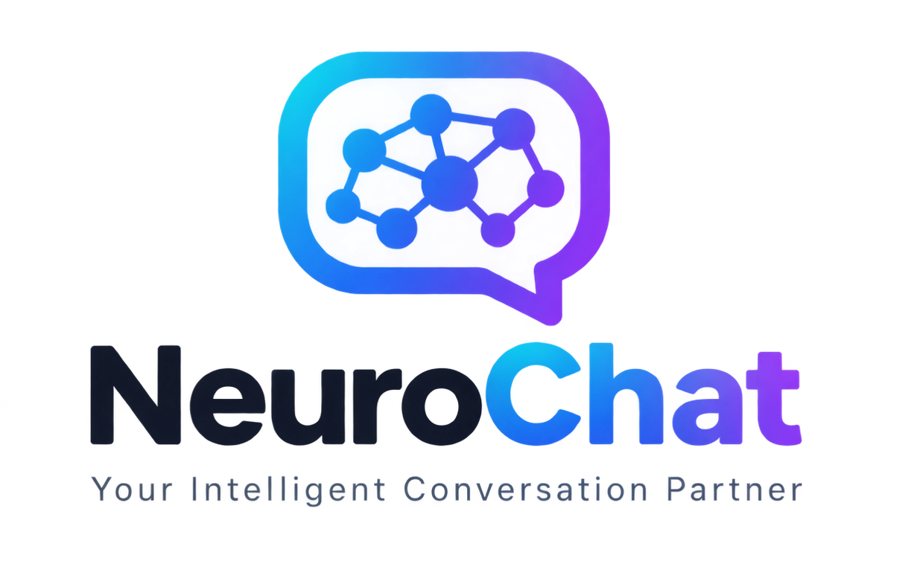

<p align="center">
  
</p>

<h1 align="center">NeuroChat — Your Intelligent Conversation Partner</h1>

<p align="center">
  <strong>Full-Stack Conversational AI Assistant with Context Memory, Multimodal Vision, Persistent Sessions, and Modern UI</strong>
</p>

<p align="center">
  
  
  
  
  
  
  
</p>

---

## 🌟 Overview

**NeuroChat** is a production-ready, full-stack AI conversational platform built as an academic field project for **BCA Semester 5**. It is the practical implementation of findings from a comprehensive research study on ChatGPT and conversational AI, designed to address the real-world limitations of chat interfaces:

- 🧠 **Cross-Conversation Persistent Memory**: Automatically detects and extracts personal facts, preferences, and background into persistent user memory (like ChatGPT), recalling them seamlessly in new chats.
- 🖼️ **Multimodal File & Image Understanding**: Upload images (`PNG`, `JPEG`, `WebP`) and documents (`PDF`, `TXT`) directly in the chat composer to ask context-rich visual and textual questions.
- 💬 **Sliding-Window Multi-Turn Context**: Preserves dialogue continuity using a bounded token/character budget algorithm so follow-up questions understand earlier turns without overflowing model limits.
- 🌓 **Dynamic Theme Switching Everywhere**: Seamless Light and Dark mode available on the landing page, login, register, and chat views with zero flash of unstyled theme.
- 📊 **Robust Fallback & Traffic Handling**: Built-in model rotation across Gemini candidates with courteous user-facing notices when API quotas or server traffic spikes occur.
- 🗂️ **Persistent, Searchable History**: Every chat is titled automatically, persisted in MongoDB, and instantly searchable with full rename and delete capabilities.
- 🌐 **Multilingual Interface**: Full bilingual support in **English** and **हिन्दी (Hindi)**.
- 🔒 **Enterprise-Grade Security**: Dual authentication via Email/Password (`bcrypt`) and Google Identity Services OAuth, protected with `httpOnly` cookies, strict CORS, rate-limiting, and zero client-side API key exposure.

---

## 🏗️ Architecture

```
┌─────────────────────────────────────────────────────────────┐
│                      Client (React 18 SPA)                  │
│       Vite · Design System · ThemeContext · ChatContext     │
└───────────────┬─────────────────────────────────────────────┘
                │
                │ HTTPS + httpOnly Cookie Session
                ▼
┌─────────────────────────────────────────────────────────────┐
│                    Express.js Backend API                    │
│     Zod Validation · Rate Limiting · Token Management        │
└───┬──────────────────────────┬──────────────────────────┬───┘
    │                          │                          │
    ▼                          ▼                          ▼
┌──────────────┐       ┌────────────────┐       ┌────────────────┐
│   MongoDB    │       │ Google Gemini  │       │ Google OAuth   │
│ Atlas/Local  │       │ Multimodal AI  │       │ Identity Token │
│ Users, Chats │       │ Server-Side    │       │ Verification   │
└──────────────┘       └────────────────┘       └────────────────┘
```

---

## 📂 Project Structure

```
NeuroChat/
├── backend/
│   ├── config/             # DB connection, environment schema, AI settings
│   ├── controllers/        # Auth, conversation, message, user controllers
│   ├── middleware/         # Auth verification, error handling, rate limiters
│   ├── models/             # Mongoose schemas (User, Conversation, Message)
│   ├── routes/             # RESTful API routes (/api/auth, /api/chat, etc.)
│   ├── services/           # Gemini AI provider, Memory extraction, Context builder
│   ├── validators/         # Zod input validation schemas
│   ├── .env.example        # Backend environment variables template
│   └── server.js           # Main Express server entry point
├── frontend/
│   ├── public/             # Favicon, app icons, logos
│   ├── src/
│   │   ├── components/     # Chat bubbles, composer, sidebar, modals, UI
│   │   ├── context/        # AuthContext, ChatContext, ThemeContext
│   │   ├── hooks/          # Voice input, speech synthesis, debounce
│   │   ├── i18n/           # English & Hindi translation catalogs
│   │   ├── pages/          # LandingPage, LoginPage, RegisterPage, ChatPage
│   │   └── styles/         # Tokens, typography, responsive utilities
│   ├── .env.example        # Frontend environment variables template
│   ├── index.html          # HTML entry with crisp icon links
│   └── vite.config.js      # Dev server & reverse proxy configuration
├── Logo/                   # High-resolution brand marks & favicons
├── docs/                   # Complete academic documentation & viva guides
└── .gitignore              # Strict ignore rules protecting all secrets
```

---

## 🚀 Getting Started

### Prerequisites
- **Node.js**: v18.0.0 or higher
- **MongoDB**: Local MongoDB instance running on port `27017` or a MongoDB Atlas connection string
- **Google Gemini API Key**: Obtain a free API key from [Google AI Studio](https://aistudio.google.com/app/apikey)

---

### 1. Clone the Repository
```bash
git clone https://github.com/YOUR_GITHUB_USERNAME/NeuroChat.git
cd NeuroChat
```

---

### 2. Backend Setup
1. Navigate to the backend directory:
   ```bash
   cd backend
   npm install
   ```

2. Configure environment variables:
   ```bash
   cp .env.example .env
   ```
   Open `backend/.env` and supply your credentials:
   ```env
   PORT=5001
   CLIENT_URL=http://localhost:5173
   MONGODB_URI=mongodb://localhost:27017/neurochat
   JWT_SECRET=your_super_secret_jwt_key_at_least_32_characters
   GEMINI_API_KEY=your_actual_gemini_api_key_here
   ```

3. Launch the backend server:
   ```bash
   npm run dev
   ```
   *The backend will be running on `http://localhost:5001`.*

---

### 3. Frontend Setup
1. Navigate to the frontend directory:
   ```bash
   cd ../frontend
   npm install
   ```

2. Configure environment variables:
   ```bash
   cp .env.example .env
   ```

3. Launch the frontend development server:
   ```bash
   npm run dev
   ```
   *Open `http://localhost:5173` in your browser.*

---

## 🔒 Security & Privacy Practices

- **Zero Secret Exposure**: Google Gemini API keys, database connection strings, and JWT signing keys exist solely in `backend/.env` and are strictly excluded from git via `.gitignore`.
- **httpOnly Session Cookies**: Session tokens cannot be accessed by client-side JavaScript, preventing XSS-based session hijacking.
- **Strict Data Scoping (IDOR Prevention)**: All database queries (fetching chats, deleting messages, updating profile) verify ownership against the authenticated user ID.
- **Sanitized Markdown**: AI outputs with code blocks and HTML are parsed safely using `rehype-sanitize` to block script injection.
- **Content Rate Limiting**: Dedicated rate limiters on authentication endpoints and AI generation prevent brute-force attacks and quota exhaustion.

---

## 📚 Project Documentation

The repository includes a comprehensive 12-chapter academic report in the [`docs/`](./docs/) directory:

| Document | Description |
|---|---|
| [MASTER_SPECIFICATION.md](./docs/MASTER_SPECIFICATION.md) | Complete system architecture, user stories, and acceptance criteria |
| [ARCHITECTURE.md](./docs/ARCHITECTURE.md) | Component diagrams, data flow, and technology stack justification |
| [DATABASE.md](./docs/DATABASE.md) | MongoDB entity relationships, indexing strategy, and collection schemas |
| [API.md](./docs/API.md) | Comprehensive REST API contract with endpoints, request, and response bodies |
| [AI_INTEGRATION.md](./docs/AI_INTEGRATION.md) | Google Gemini integration, sliding window memory, and multimodal processing |
| [AUTHENTICATION.md](./docs/AUTHENTICATION.md) | Dual auth workflow (Email/Password + Google OAuth) with cookie security |
| [VIVA.md](./docs/VIVA.md) | 25+ essential academic viva questions and model answers |

---

## 📄 License

This project is open source and available under the [MIT License](LICENSE).
